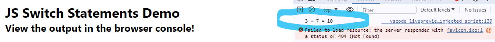

# JavaScript Switch Statements

## Submitting Your Work
 - Save your project files to a new GitHub repo named: ***switch-statements-js***
 - Submit on Google Classroom the web address (URL) that points to your repo 

## Sample Output

Your finished project should look similar to this example:

*Simple addition with the switch statement*

## Specifications

Write a script that meets the following specifications:

- includes a comment block (name, current date, project title) at the top of your script
- uses the keywords **let** or **const** for variable declarations
- uses correct spelling and grammar throughout

## Helpful Resources

 - [w3schools.com: Switch statements](https://www.w3schools.com/js/js_switch.asp)
 - [Web Dev Simplified: Switch Statements](https://youtu.be/2gE2K8i5tvs?feature=shared)
 
## Directions

 - Add a comment block to the top of your script
 - Prompt the user to enter a letter code:
   - A for addition
   - S for subtraction
   - use the toUpperCase ( ) method to convert the letter code to uppercase 
 - prompts the user to enter two (2) numbers
   - NOTE: Use the *parseFloat ( )* function to convert the user's input to numbers
 - Use a switch statement to determine whether the user wants to do addition or subtraction
 - Perform the addition or subtraction
 - Use template strings to build your output strings
 - Use the *console.log ( )* method to display the output in the browser console

